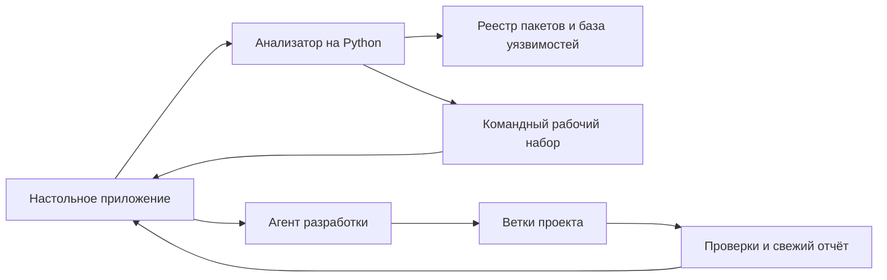
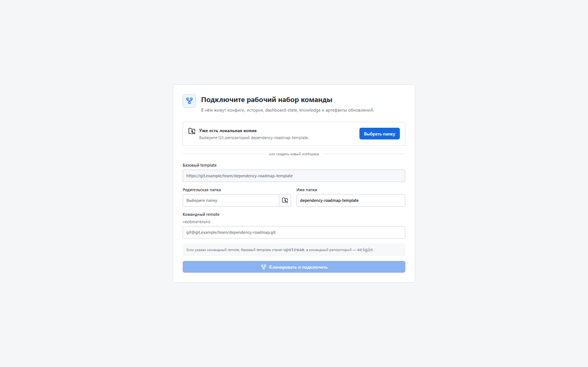

# Как перестать обновлять зависимости вслепую

Обновление зависимостей редко выглядит сложной задачей на бумаге. Нужно посмотреть версии, выбрать новые, поменять несколько строк и запустить проверки. На практике именно здесь начинается длинная цепочка ручной работы: понять, что действительно устарело, отделить безопасные обновления от рискованных, изучить уязвимости и заметки к выпускам, договориться о порядке изменений, подготовить контекст для исполнителя, не потерять прогресс после прерывания и доказать на проверке, что результат соответствует исходному плану.

Так появилась Dependency Flow — настольная программа, которая превращает разрозненное обновление зависимостей в понятный и воспроизводимый процесс.

> Все снимки экрана в статье сделаны на вымышленных данных. Названия проектов, веток и адреса заменены.

## Какая проблема была до появления программы

Обычно обновление зависимостей начинается не с кода, а с расследования. Сведения разбросаны между `package.json`, файлом блокировки версий, реестром пакетов, описаниями выпусков, базой уязвимостей и историей репозитория. Даже если всю эту информацию удалось собрать, остаются вопросы:

- до какой версии обновляться прямо сейчас;
- какие пакеты можно менять вместе, а какие лучше разделить;
- какие изменения действительно нужны для цели, а какие случайно расширяют работу;
- в какой ветке должен находиться каждый результат;
- как продолжить работу после остановки агента;
- как проверить, что итоговая ветка не отличается от согласованного плана.

Когда на проекте несколько десятков зависимостей, значительная часть времени уходит не на саму замену версий, а на подготовку, согласование, повторное погружение и проверку. Чем больше участников, тем дороже каждая потеря контекста.

Dependency Flow собирает этот процесс в одну последовательность из девяти этапов:

1. проверка окружения и Git;
2. фиксация исходного состояния;
3. согласование плана обновления;
4. выполнение миграции агентом;
5. перестроение отчёта;
6. независимая проверка;
7. создание чистой итоговой ветки;
8. сохранение состояния команды;
9. публикация результата.

Главная ценность программы не в том, что она «сама обновляет всё». Она делает границы работы явными и проверяемыми.

### Что она действительно решает

**Даёт одну картину состояния.** Программа собирает версии, отставание, известные уязвимости и сведения о выпусках в единую панель. Не нужно вручную сводить несколько источников.

**Помогает выбрать реалистичную цель.** Вместо безусловной гонки за самыми свежими версиями можно выбрать жёлтый или зелёный уровень. План строится консервативно: сначала полезные и сравнительно безопасные обновления, отдельно — сложные и потенциально ломающие изменения. Пакет, который команда осознанно переносит на потом, можно исключить из расчёта с обязательной причиной: строка останется видимой, но перестанет искажать проценты, сводные числа и уязвимости, цвет проекта и план веток.

**Фиксирует договорённость до начала работ.** Список пакетов и группы миграции видны заранее. Из него формируются точное задание для агента и план веток. Если в Git появляется группа вне согласованного плана, программа показывает расхождение и останавливает автоматическое продолжение.

**Сохраняет контекст.** Исходный снимок, настройки, история, задание агенту и состояние панели лежат в командном рабочем наборе. После прерывания агент может продолжить сохранённый сеанс, а коллега — понять, что уже сделано.

**Проверяет результат, а не только код завершения.** Успешное окончание процесса агента ещё не означает успешную миграцию. Dependency Flow сверяет реальные ветки с планом, проверяет, что изменения дошли до объединённой ветки, что рабочая папка чистая и что обновлённый отчёт подтверждает результат.

**Готовит материал для проверки.** На выходе формируются три документа: технический список изменений, человеческое описание пользы и полная карта изменений для проверяющего.

## Как это сокращает время выхода изменения

Здесь важно не обещать магические проценты. Программа не сделает сложный переход между основными версиями библиотеки мгновенным и не заменит знания команды о продукте. Она сокращает другое время — то, которое обычно теряется между решением «надо обновить» и готовой проверенной веткой.

| Раньше | С Dependency Flow |
| --- | --- |
| Состояние пакетов собирается вручную | Один запуск строит общую картину |
| Порядок обновлений хранится в переписке | План и группы зафиксированы в рабочем наборе |
| Агенту каждый раз заново передают контекст | Задание формируется из согласованного плана |
| После прерывания приходится восстанавливать ход работы | Сеанс и прогресс можно продолжить |
| Лишние ветки замечают во время проверки | Расхождение с планом останавливает процесс раньше |
| Итог приходится объяснять по истории коммитов | Готовы три документа для проверки и выпуска |

Наибольшая экономия появляется в повторяемых действиях: сборе сведений, передаче контекста, возврате к прерванной работе и подготовке доказательств. Это уменьшает очереди и переделки, поэтому сокращается время от решения об обновлении до готовой итоговой ветки — то, что часто называют TTM.

Чтобы оценить эффект на своей команде, лучше не придумывать проценты заранее, а замерить несколько прогонов:

- календарное время от исходного снимка до итоговой ветки;
- чистое время разработчика на подготовку и проверку;
- количество повторных запусков после прерываний;
- число отклонений от плана, найденных до проверки кода;
- число проблем, обнаруженных уже после объединения.

## Как программа устроена внутри

Внутри нет одного большого «чёрного ящика». Решение состоит из нескольких простых частей, каждая отвечает за свою задачу.



**Настольное приложение** ведёт пользователя по этапам, запускает команды, показывает ход работы и следит за состоянием Git. Оно не считает задачу завершённой только потому, что агент закончил работу.

**Анализатор на Python** читает `package.json` и файл блокировки версий, обращается к реестру пакетов и базе уязвимостей, рассчитывает состояние проекта, предлагает целевые версии и формирует отчёты.

**Командный рабочий набор** — отдельный Git-репозиторий с настройками, историей, исходными снимками и результатами прогонов. Он хранит общую память процесса, но не смешивается с кодом продукта.

**Агент разработки** получает не свободное пожелание «обнови зависимости», а зафиксированный список пакетов, групп и веток. Сейчас поддерживаются Codex, OpenCode и Claude при наличии соответствующей командной программы в системе.

**Проверки** сравнивают состояние до и после, ищут незапланированные изменения, проверяют файл блокировки версий и убеждаются, что работа действительно попала в нужную объединённую ветку.

## Быстрый старт

### Что понадобится

Для готового настольного приложения нужен Windows. Также должны быть доступны:

- Git;
- Python 3;
- используемый проектом npm или Yarn;
- хотя бы один поддерживаемый агент: Codex, OpenCode или Claude;
- доступ к реестру пакетов и репозиториям команды.

Программа сама показывает состояние окружения справа, поэтому отсутствующий инструмент виден ещё до запуска миграции.

### 1. Скачайте и установите приложение

Откройте страницу [последнего выпуска Dependency Flow](https://github.com/example/frontend-deps-tool/releases/latest), скачайте установщик `.exe` из приложенных файлов и запустите его.

Если репозиторий выпусков закрытый, для автоматической проверки обновлений понадобится токен Git hosting только с правом `read_api`. После успешного сохранения ключ в шапке становится зелёным. Токен шифруется защищённым хранилищем Windows, не попадает в рабочий набор и сохраняется после перезапуска. Программа проверяет обновление вскоре после запуска и затем раз в четыре часа; кнопка установки неактивна, пока новая версия не скачана.

### 2. Подключите рабочий набор команды

При первом запуске можно выбрать уже существующую локальную копию рабочего набора или создать новую из шаблона. Если указать адрес командного репозитория, он станет основным, а базовый шаблон останется источником обновлений.



В рабочем наборе хранятся настройки проектов, история и отчёты. Его удобно завести один раз на команду и публиковать так же, как обычный Git-репозиторий.

### 3. Добавьте проект

Нажмите «Добавить проект», выберите локальную Git-папку и задайте ветки:

- исходную ветку, обычно `master`;
- основу имён рабочих веток;
- объединённую ветку, куда должны попасть группы миграции.


Минимальная настройка в `.dependency-roadmap/settings.project.json` выглядит примерно так:

```json
{
  "root": "C:/work",
  "projects": [
    {
      "name": "personal-account",
      "path": "personal-account",
      "git": {
        "sourceBranch": "master",
        "baseBranch": "deps-2026-q3",
        "branchPrefix": "deps-2026-q3",
        "mergedBranch": "deps-2026-q3-merged",
        "releaseBranch": "deps-2026-q3-release",
        "push": false
      }
    }
  ]
}
```

На первом прогоне безопаснее оставить отправку веток выключенной. Тогда все изменения останутся локальными до явного решения пользователя.

### 4. Проверьте проект и снимите исходное состояние

Начните с «Подготовки». Программа проверит Git, настройки и доступность инструментов. Нажатие на строку этапа только открывает сведения справа; команда запускается отдельной кнопкой внизу. Поэтому план можно спокойно просматривать, не опасаясь случайного запуска. Повторная кнопка «Проверить» обновляет окружение, но не возвращает уже начатый прогон к baseline.

Затем снимите исходное состояние. Оно нужно для честного сравнения «до» и «после», поэтому после начала обновлений переснимать его нельзя.

### 5. Согласуйте план до запуска агента

Откройте панель, выберите целевой уровень и проверьте предложенные версии и группы. Это важная точка принятия решения: после согласования именно этот список становится границей работы. Если отдельный пакет нужно перенести на позднюю миграцию, исключите его из текущей статистики и обязательно укажите причину. Он останется в отчёте, но не будет влиять на итоговые проценты, цвет, предложения версий и группы текущего плана.

Выгрузите задание агенту из панели. Вместе с ним сохраняются контрольные суммы плана и точная схема веток. Агент не должен придумывать дополнительные группы по ходу работы.


### 6. Запустите миграцию и следите за прогрессом

Выберите доступного агента и нажмите «Запустить агента». Программа будет показывать не только журнал команд, но и фактическое состояние групп по Git.

Если работа прервалась, можно продолжить тот же сеанс. Перед новым запуском программа сохраняет текущие изменения в защитное хранилище Git. Если появляется незапланированная ветка, меняется состав группы или прогресс не подтверждается репозиторием, автоматическое продолжение останавливается и требует внимания человека.

### 7. Выполните проверки и создайте итоговую ветку

После миграции перестройте отчёт и запустите независимую проверку. Для npm это обычный `npm audit`. Для Yarn Classic программа строит из `yarn.lock` изолированный `package-lock.json`, обращается к тому же npm/registry registry и сохраняет рядом команду `reproduce-npm-audit.cmd`. Поэтому пользователь может повторить проверку самостоятельно. Исходный проект при этом не получает чужой lockfile. Найденные уязвимости дают коду `npm audit` значение `1`, но это результат проверки, а не техническое падение; код `2` означает, что доказательства действительно неполны.

После агента программа проверяет каждую строку согласованного плана по фактическому package.json и lockfile. Сам факт, что все групповые ветки вошли в объединённую ветку, недостаточен: если хотя бы один пакет остался ниже согласованной версии, счётчик показывает его незавершённым, а агент получает точный список расхождений для продолжения. После свежего пересчёта программа также проверяет итоговый цвет; например, красный уровень с 57,9% не может пройти к аудиту и выпуску при цели «Жёлтый» с порогом 80%.

Только после этого создайте итоговую release-ветку. При необходимости укажите команду окончательной проверки проекта, например тесты и сборку. Если в проекте остались незакоммиченные отслеживаемые или новые файлы, программа сначала сохранит их в именованный защитный stash Git и напечатает точную команду восстановления. Эти изменения не накладываются на итоговую ветку автоматически, чтобы не смешивать локальную работу с чистым объединённым изменением. Неудачную итоговую проверку или Git-hook можно исправить и повторить без отката предыдущих этапов.

В конце сохраните состояние рабочего набора и опубликуйте результат. Последний этап сначала отправляет сохранённую итоговую ветку проекта, затем состояние командного рабочего набора; зелёная галочка означает успешное выполнение обеих операций. В коммит состояния попадают только командные настройки, история, состояние панели и база знаний (`knowledge`); локальные загрузки и кеши пропускаются. Повтор без новых изменений завершается спокойно, без пустого коммита. Полностью завершённый прогон выглядит так:


Для нескольких проектов есть команда «Актуализировать все», но начинать знакомство с программой лучше с одного проекта и одной небольшой группы.

## Ограничения

Dependency Flow сознательно остаётся помощником, а не автономной системой выпуска.

**Основной сценарий — зависимости npm и Yarn.** Для других экосистем потребуются отдельные анализаторы и проверки.

**Сложные миграции всё равно требуют инженерного решения.** Если новая версия меняет устройство приложения, публичный договор или поведение сборки, агенту понадобятся знания команды, а результату — внимательная проверка.

**Качество результата ограничено качеством тестов.** Программа проверяет план, ветки и версии, но не может доказать корректность поведения продукта без надёжных тестов и проверки специалистом.

**Сведения о выпусках собираются настолько полно, насколько позволяют источники.** Закрытый реестр, недоступная база уязвимостей или неполные описания выпусков снижают полноту отчёта. Такие места нужно воспринимать как повод для ручной проверки, а не как отсутствие риска.

**Защита плана — это контроль, а не запрет на уровне операционной системы.** Агент технически способен создать лишнюю ветку. Программа обнаружит её, не засчитает миграцию и остановит автоматическое продолжение, но человеку всё равно нужно решить, удалить ветку или скорректировать согласованный план.

**Нужна дисциплина Git.** Исходная, рабочие, объединённая и итоговая ветки должны иметь понятное назначение. Перед миграцией и созданием итоговой ветки программа умеет сохранять незакоммиченные изменения в защитный stash Git, но решение о последующем `git stash apply` и возможных конфликтах остаётся за пользователем.

**Аудит Yarn воспроизводим, но является приближением npm-графа.** Изолированный `package-lock.json` даёт большинству пользователей одинаковую понятную команду `npm audit`, однако разрешение зависимостей npm может немного отличаться от фактического графа `yarn.lock`. Ограничение явно записывается в отчёт и не скрывает неполные ответы реестра.

**Настольный путь сейчас ориентирован на Windows.** Анализатор состоит из сценариев Python, однако готовый установщик и основной пользовательский путь рассчитаны на Windows.

**Публикация остаётся явным действием.** Отправка рабочих веток и состояния команды не выполняется незаметно. Это безопаснее, но требует от пользователя завершить последние этапы процесса.

## Что в итоге

Dependency Flow полезна там, где обновления зависимостей уже перестали быть разовой уборкой и стали регулярной инженерной работой. Она не убирает сложность библиотек, зато убирает значительную часть организационного шума вокруг них: собирает сведения, фиксирует решение, выдаёт исполнителю точное задание, сохраняет прогресс и проверяет результат по фактам в Git.

В результате команда быстрее доходит от решения «обновляем» до проверенной итоговой ветки, а проверяющий получает не набор случайных коммитов, а понятную историю: что было, что планировали, что изменили и чем подтверждён результат.